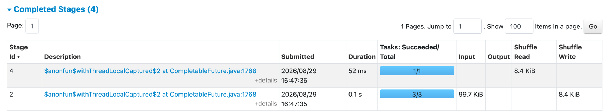
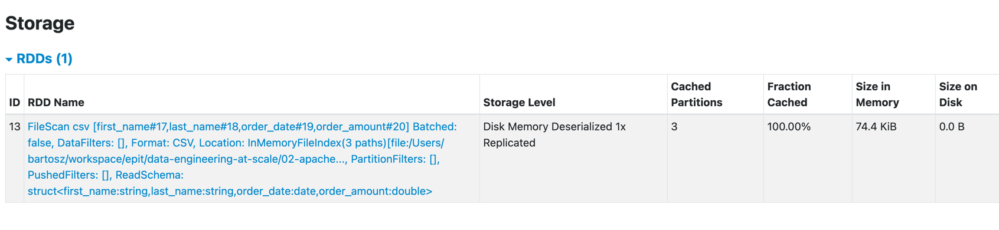
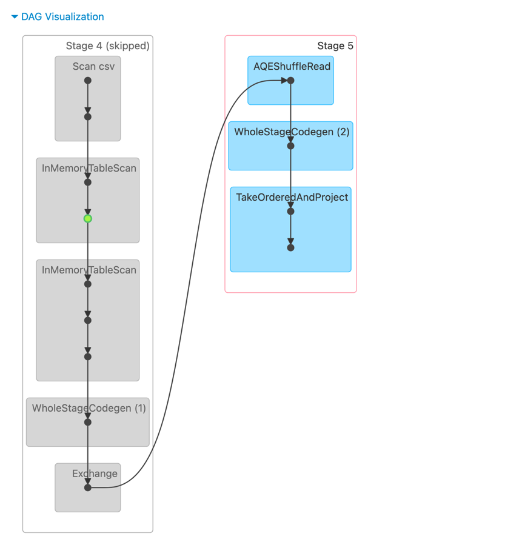

# Apache Spark DataFrames and Transformations

## Prerequisites
1. `uv` and `uv sync` to install all required dependencies.
```bash
uv sync
uv lock
```

2. Generate data
File: `generate_data.py`

This script generates synthetic orders CSV files using the Faker library. Each file
contains rows with `first_name`, `last_name`, `order_date`, and `order_amount` columns.
The random seed is fixed so results are reproducible across runs.

Generate 3 files with 1,000 rows each into the `data/` directory:
```bash
uv run generate_data.py --rows 1000 --num-files 3 --output-dir data
```

You should see one log line per file followed by a summary:
```
06:42:55  INFO      generating 3 files × 1,000 rows into 'data/'
06:42:55  INFO      created data/orders_region_1.csv  (1,000 rows)
06:42:55  INFO      created data/orders_region_2.csv  (1,000 rows)
06:42:55  INFO      created data/orders_region_3.csv  (1,000 rows)
06:42:55  INFO      done — total rows generated: 3,000
```

The generated files follow the naming pattern `orders_region_N.csv` and are used as
input by all subsequent demos.

## Demo 1: DataFrame transformations — three APIs for the same piece of work
Files: `orders_transformations.py`, `orders_transformations_sql.py`, `orders_transformations_map.py`

All three files apply the same logical transformation to the orders dataset:
- keep only rows where `order_amount > 50`
- combine `first_name` and `last_name` into a single `client_name` column
- project `client_name`, `order_date`, and `order_amount`

They differ only in the API used to express that logic:

| | `orders_transformations.py` | `orders_transformations_sql.py` | `orders_transformations_map.py` |
|---|---|---|---|
| API | DataFrame (column expressions) | Spark SQL | `mapInArrow` (PyArrow) |
| Filter | `F.col("order_amount") > 50` | `WHERE order_amount > 50` | `pc.greater(batch.column("order_amount"), 50.0)` |
| Name concat | `F.concat_ws(" ", ...)` | `CONCAT(first_name, ' ', last_name)` | `pc.binary_join_element_wise(...)` |
| Schema declaration | Inferred | Inferred | Must be declared upfront |

1. Run the DataFrame API version:
```bash
uv run orders_transformations.py
```

2. Run the SQL version (identical output, different syntax):
```bash
uv run orders_transformations_sql.py
```

3. Run the `mapInArrow` version:
```bash
uv run orders_transformations_map.py
```

`mapInArrow` receives an iterator of `pyarrow.RecordBatch` objects — one per Spark
partition — and yields transformed `pyarrow.RecordBatch` objects back. Because Spark
cannot inspect the function body at plan time, the output schema must be declared
explicitly via the `OUTPUT_SCHEMA` constant.

Despite high-level API differences, all three jobs produce the same result:
```
+---------------+----------+------------+
|client_name    |order_date|order_amount|
+---------------+----------+------------+
|Stephen Solis  |2023-01-01|3039.44     |
|Angela Howe    |2023-01-01|9756.47     |
|Veronica Casey |2023-01-02|9918.38     |
|Tara Ramirez   |2023-01-02|7759.4      |
|Victoria Lara  |2023-01-02|7033.83     |
|Kristin Dean   |2023-01-03|7589.53     |
|Monique Johnson|2023-01-03|6576.94     |
|Lisa Stark     |2023-01-03|2135.0      |
|Emily Walker   |2023-01-04|5199.68     |
|Heather Cooper |2023-01-04|9487.92     |
+---------------+----------+------------+
only showing top 10 rows
```

## Demo 2: Union
Files: `orders_union.py`, `orders_union_files.py`

Both jobs demonstrate `unionByName`, which combines two DataFrames by matching column
names rather than column positions. The key step is aligning column names before the
union when the source schemas differ.

| | `orders_union.py` | `orders_union_files.py` |
|---|---|---|
| Source | In-memory `createDataFrame` | CSV file + JSON file |
| Group 1 columns | `first_name`, `last_name`, `amount` | `first_name`, `last_name`, `amount` |
| Group 2 columns | `user_first_name`, `user_last_name`, `order_amount` | `user_first_name`, `user_last_name`, `order_amount` |
| Alignment | `withColumnRenamed` | `withColumnRenamed` |

1. Run the in-memory union:
```bash
uv run orders_union.py
```

It should return the combination of both DataFrames as a single data processing
abstraction:
```
+----------+---------+------+-------------+                                     
|first_name|last_name|amount|source       |
+----------+---------+------+-------------+
|Alice     |Smith    |120.5 |orders_group1|
|Bob       |Jones    |45.0  |orders_group1|
|Carol     |White    |200.75|orders_group1|
|Dave      |Brown    |89.99 |orders_group2|
|Eve       |Davis    |310.0 |orders_group2|
+----------+---------+------+-------------+
```

2. Run the file-based union:
```bash
uv run orders_union_files.py
```

The file-based demo first prints both schemas so you can see the naming mismatch before alignment:
```
=== Group 1 schema (CSV) ===
root
 |-- first_name: string (nullable = true)
 |-- last_name: string (nullable = true)
 |-- amount: double (nullable = true)

=== Group 2 schema (JSON) ===
root
 |-- user_first_name: string (nullable = true)
 |-- user_last_name: string (nullable = true)
 |-- order_amount: double (nullable = true)
```

After renaming Group 2 columns to match Group 1, both are combined with `unionByName`:
```
+----------+---------+------+
|first_name|last_name|amount|
+----------+---------+------+
|Alice     |Smith    |120.5 |
|Bob       |Jones    |45.0  |
|...       |...      |...   |
+----------+---------+------+
```

> If you don't rename the columns and keep the `allowMissingColumns=False`, the job will fail with this error:
> pyspark.errors.exceptions.captured.AnalysisException: Cannot resolve column name "first_name" among (order_amount, user_first_name, user_last_name).

## Demo 3: Shuffle
File: `orders_shuffle.py`

This job groups orders by calendar month and sums the `order_amount` per group.
The `groupBy` triggers a shuffle: Spark redistributes all rows so that every row
for the same month lands on the same executor before the aggregation runs.

1. Run the job:
```bash
uv run orders_shuffle.py
```

Expected output — one row per month sorted chronologically:
```
+-------------------+------------+
|order_month        |total_amount|
+-------------------+------------+
|2023-01-01 00:00:00|295939.85   |
|2023-02-01 00:00:00|162956.13   |
|2023-03-01 00:00:00|372034.91   |
|2023-04-01 00:00:00|332041.8    |
|2023-05-01 00:00:00|361913.3    |
|2023-06-01 00:00:00|337046.8    |
|2023-07-01 00:00:00|396968.47   |
|2023-08-01 00:00:00|339348.85   |
|2023-09-01 00:00:00|292115.43   |
|2023-10-01 00:00:00|417847.21   |
+-------------------+------------+
```

Open the Spark UI at [http://localhost:4040](http://localhost:4040) while the job runs.
Navigate to the **Stages** tab and look for the stage that contains a shuffle write
followed by a shuffle read — this is where the data is redistributed across partitions.


## Demo 4: Caching
File: `orders_combined.py`

This job runs two independent transformations from the same base `orders` DataFrame:
1. A filter + `client_name` projection (from `orders_transformations.py`)
2. A monthly revenue aggregation (from `orders_shuffle.py`)

Without caching, Spark would re-read and re-parse all CSV files twice — once per
action. `orders.cache()` after loading ensures the first action populates the in-memory
cache; the second transformation is then served from memory.

1. Run the job:
```bash
uv run orders_combined.py
```

The job prints both results and then calls `orders.unpersist()` to free the cached data:
```
=== Filtered orders (amount > 50) ===
+---------------+----------+------------+
|client_name    |order_date|order_amount|
+---------------+----------+------------+
|Angela Howe    |2023-01-01|9756.47     |
|Stephen Solis  |2023-01-01|3039.44     |
|Veronica Casey |2023-01-02|9918.38     |
|Tara Ramirez   |2023-01-02|7759.4      |
|Victoria Lara  |2023-01-02|7033.83     |
|Kristin Dean   |2023-01-03|7589.53     |
|Monique Johnson|2023-01-03|6576.94     |
|Lisa Stark     |2023-01-03|2135.0      |
|Emily Walker   |2023-01-04|5199.68     |
|Heather Cooper |2023-01-04|9487.92     |
+---------------+----------+------------+
only showing top 10 rows
=== Monthly revenue totals ===
+-------------------+------------+
|order_month        |total_amount|
+-------------------+------------+
|2023-01-01 00:00:00|295939.85   |
|2023-02-01 00:00:00|162956.13   |
|2023-03-01 00:00:00|372034.91   |
|2023-04-01 00:00:00|332041.8    |
|2023-05-01 00:00:00|361913.3    |
|2023-06-01 00:00:00|337046.8    |
|2023-07-01 00:00:00|396968.47   |
|2023-08-01 00:00:00|339348.85   |
|2023-09-01 00:00:00|292115.43   |
|2023-10-01 00:00:00|417847.21   |
+-------------------+------------+
only showing top 10 rows
```

In the Spark UI (**Storage** tab) you can confirm that the `orders` DataFrame is cached
after the first action completes.


It disappears from the Storage tab after `unpersist()`. That's why the call is left after the 
`while` loop.

You can also visualize cached DataFrames in the **Jobs** section, with a green dot:


## Demo 5: Writing and reading formats
Files: `orders_write.py`, `orders_read.py`

`orders_write.py` writes the monthly totals aggregation to three formats. `orders_read.py`
reads them back and prints each schema alongside the data.

| Format | Schema on write | Schema on read                                                 | Notable property |
|---|---|----------------------------------------------------------------|---|
| JSON | Not embedded | Inferred by sampling files, or must be declared as a parameter | Human-readable; one file per partition |
| Parquet | Embedded in footer | Read from footer — no inference                                | Columnar binary, Snappy compression by default |
| Delta Lake | Embedded in `_delta_log/` | Read from transaction log                                      | ACID semantics, time travel, schema enforcement |

1. Write the three formats (requires `data/` from Demo 1):
```bash
uv run orders_write.py
```

2. Read them back, individually for each format:
```bash
uv run orders_read.py
```

All three should print an identical schema and identical data:
```
=== JSON ===
root
 |-- order_month: string (nullable = true)
 |-- total_amount: double (nullable = true)

+-----------------------------+------------+
|order_month                  |total_amount|
+-----------------------------+------------+
|2023-01-01T00:00:00.000+01:00|295939.85   |
|2023-02-01T00:00:00.000+01:00|162956.13   |
|2023-03-01T00:00:00.000+01:00|372034.91   |
|2023-04-01T00:00:00.000+02:00|332041.8    |
|2023-05-01T00:00:00.000+02:00|361913.3    |
|2023-06-01T00:00:00.000+02:00|337046.8    |
|2023-07-01T00:00:00.000+02:00|396968.47   |
|2023-08-01T00:00:00.000+02:00|339348.85   |
|2023-09-01T00:00:00.000+02:00|292115.43   |
|2023-10-01T00:00:00.000+02:00|417847.21   |
|2023-11-01T00:00:00.000+01:00|281914.6    |
|2023-12-01T00:00:00.000+01:00|340052.3    |
|2024-01-01T00:00:00.000+01:00|301631.55   |
|2024-02-01T00:00:00.000+01:00|299014.39   |
|2024-03-01T00:00:00.000+01:00|331987.5    |
|2024-04-01T00:00:00.000+02:00|352278.36   |
|2024-05-01T00:00:00.000+02:00|346827.77   |
|2024-06-01T00:00:00.000+02:00|206924.74   |
|2024-07-01T00:00:00.000+02:00|331187.72   |
|2024-08-01T00:00:00.000+02:00|285598.18   |
+-----------------------------+------------+
only showing top 20 rows
=== Parquet ===
root
 |-- order_month: timestamp (nullable = true)
 |-- total_amount: double (nullable = true)

+-------------------+------------+
|order_month        |total_amount|
+-------------------+------------+
|2023-01-01 00:00:00|295939.85   |
|2023-02-01 00:00:00|162956.13   |
|2023-03-01 00:00:00|372034.91   |
|2023-04-01 00:00:00|332041.8    |
|2023-05-01 00:00:00|361913.3    |
|2023-06-01 00:00:00|337046.8    |
|2023-07-01 00:00:00|396968.47   |
|2023-08-01 00:00:00|339348.85   |
|2023-09-01 00:00:00|292115.43   |
|2023-10-01 00:00:00|417847.21   |
|2023-11-01 00:00:00|281914.6    |
|2023-12-01 00:00:00|340052.3    |
|2024-01-01 00:00:00|301631.55   |
|2024-02-01 00:00:00|299014.39   |
|2024-03-01 00:00:00|331987.5    |
|2024-04-01 00:00:00|352278.36   |
|2024-05-01 00:00:00|346827.77   |
|2024-06-01 00:00:00|206924.74   |
|2024-07-01 00:00:00|331187.72   |
|2024-08-01 00:00:00|285598.18   |
+-------------------+------------+
only showing top 20 rows
=== Delta Lake ===
root
 |-- order_month: timestamp (nullable = true)
 |-- total_amount: double (nullable = true)

+-------------------+------------+
|order_month        |total_amount|
+-------------------+------------+
|2023-01-01 00:00:00|295939.85   |
|2023-02-01 00:00:00|162956.13   |
|2023-03-01 00:00:00|372034.91   |
|2023-04-01 00:00:00|332041.8    |
|2023-05-01 00:00:00|361913.3    |
|2023-06-01 00:00:00|337046.8    |
|2023-07-01 00:00:00|396968.47   |
|2023-08-01 00:00:00|339348.85   |
|2023-09-01 00:00:00|292115.43   |
|2023-10-01 00:00:00|417847.21   |
|2023-11-01 00:00:00|281914.6    |
|2023-12-01 00:00:00|340052.3    |
|2024-01-01 00:00:00|301631.55   |
|2024-02-01 00:00:00|299014.39   |
|2024-03-01 00:00:00|331987.5    |
|2024-04-01 00:00:00|352278.36   |
|2024-05-01 00:00:00|346827.77   |
|2024-06-01 00:00:00|206924.74   |
|2024-07-01 00:00:00|331187.72   |
|2024-08-01 00:00:00|285598.18   |
+-------------------+------------+
only showing top 20 rows
```

> Note: the JSON schema infers `order_month` as `string` rather than `timestamp`
> because JSON has no native timestamp type. Parquet and Delta Lake preserve the
> original type from the write.
