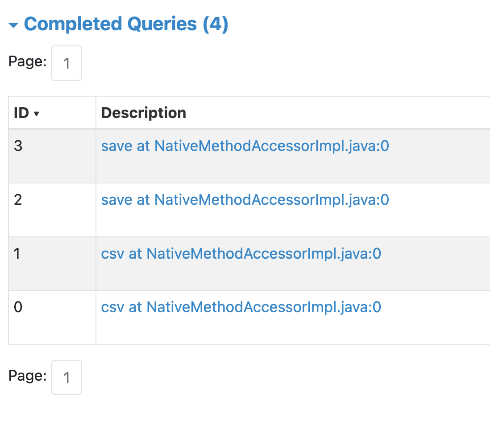
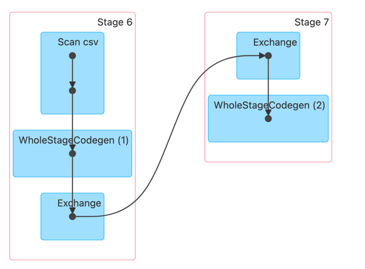
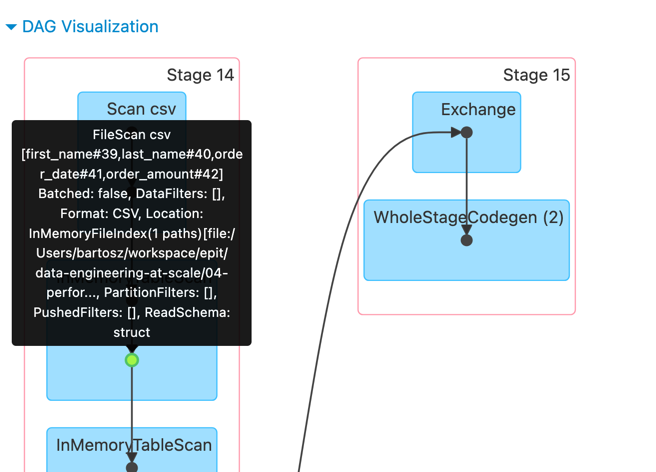
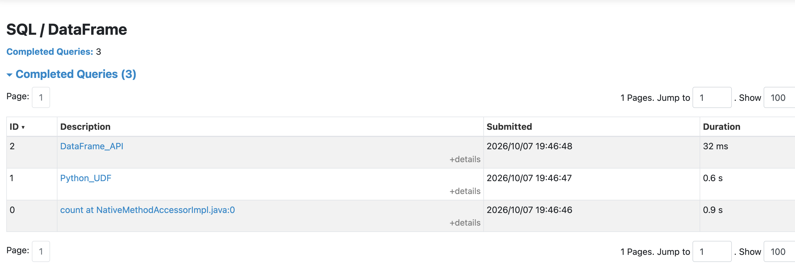
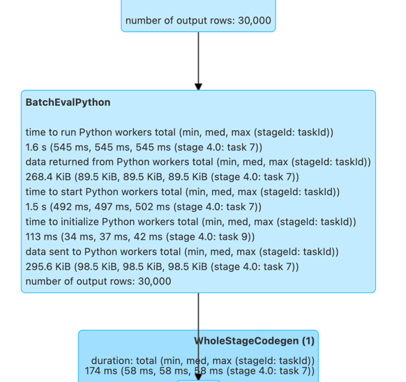
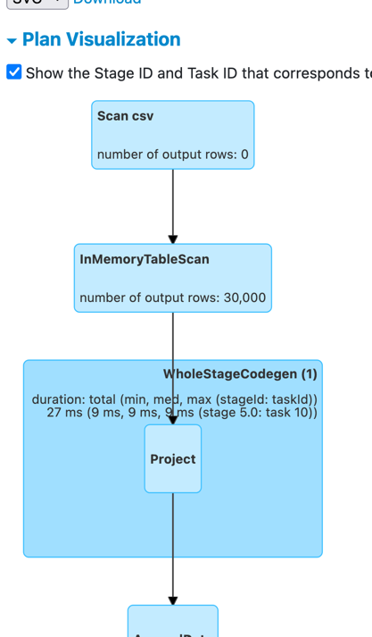
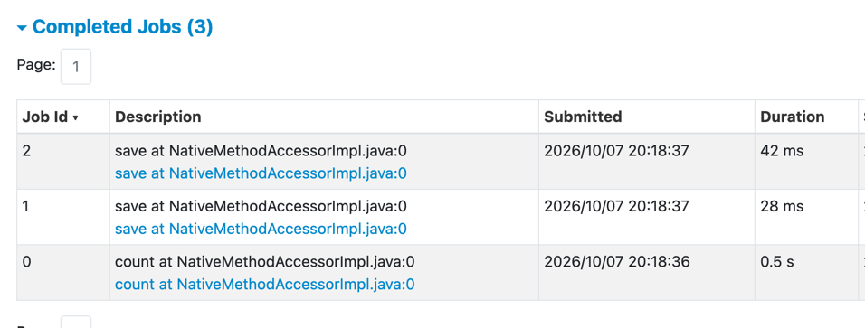

# Performance and Execution Plans

## Prerequisites

1. `uv` and `uv sync` to install all required dependencies.
```bash
uv sync
uv lock
```

2. The code-smell demos uses the orders CSV files that you can generate that way.
```bash
uv run generate_data.py --rows 10000 --num-files 6 --output-dir data
```

---

## Code smells demos

### Smell 1 — Schema inference for CSV / JSON
File: [smell_1_schema_inference.py](smell_1_schema_inference.py)
`inferSchema=True` makes Spark scan the files twice: once to detect column
types, once to actually read the data. An explicit schema skips the first scan.

1. Run the demo code:
```bash
uv run smell_1_schema_inference.py
```
2. Go to Spark UI at http://localhost:4040. In the SQL tab you should notice 2 _csv_ jobs preceeding the 
first save made on the inferred DataFrame.



### Smell 2 — Missing cache

File: [smell_2_missing_cache.py](smell_2_missing_cache.py)

Without `.cache()`, every action re-reads and re-processes the source files.
The demo runs two actions (`.count()` and `.agg()`) on the same DataFrame —
first without caching, then with caching.

1. Run the demo:
```bash
uv run smell_2_missing_cache.py
```

2. Go to Spark UI at http://localhost:4040. You should notice the same number of Jobs for each
scenario. The single difference between them will be at the Job details level. Click on one of them
and for the not-cached scenario you should see re-reading CSV files each time:


While for the same type of job - `save()` in our screenshot - the CSV reading task will be marked
as read from memory (green dot):


### Smell 3 — Python UDF

File: [smell_3_python_udf.py](smell_3_python_udf.py)

A Python UDF forces Spark to serialize every row from the JVM to the Python
interpreter, call the function, and serialize the result back. Built-in
`pyspark.sql.functions` stay entirely in the JVM and benefit from Whole-Stage CodeGen (Java).

1. Start the demo:
```bash
uv run smell_3_python_udf.py
```

2. Go to Spark UI at http://localhost:4040. You should first notice an execution time differnece in the 
UI tab:


And once you click on the _Python_UDF_, you should notice an extra `BatchEvalPython` node that 
clearly shows some time spent on the Python Virtual Machine:


This is not visible for the DataFrame API:


### Smell 4 — SELECT *

File: [smell_4_select_star.py](smell_4_select_star.py)

`SELECT *` prevents Catalyst from applying `ColumnPruning`. For columnar
formats like Apache Parquet or Delta Lake this means reading and decompressing
every column from disk, even if only one is needed downstream. The difference
is visible in the `ReadSchema` field of the Physical Plan.

1. Run the demo:
```bash
uv run smell_4_select_star.py
```

2. You should see the execution plan used for `SELECT *` needs all the columns at the filter stage
while the plan for `SELECT first_name, last_name` only references those columns, plus the column used
in the filter:
```
# SELECT *
(5) Filter [codegen id : 1]
Input [4]: [first_name#8, last_name#9, order_date#10, order_amount#11]
Condition : (isnotnull(order_amount#11) AND (order_amount#11 > 1000.0))

# SELECT first_name, last_name
(5) Filter [codegen id : 1]
Input [3]: [first_name#8, last_name#9, order_amount#11]
Condition : (isnotnull(order_amount#11) AND (order_amount#11 > 1000.0))
```

Having less columns means less memory and CPU pressure.

### Smell 5 — Single partition

File: [smell_5_single_partition.py](smell_5_single_partition.py)

The `.repartition(1)` and a Window spec without `partitionBy` both funnel all data
to a single executor task, eliminating parallelism. The demo shows partition
counts for `repartition(1)` and compares the Physical Plans for windowed
aggregations with and without `partitionBy`.

1. Run the demo:
```bash
uv run smell_5_single_partition.py
```

2. You should see the number of partitions falling back to 1 in case of repartitioning while 
without this, the number is higher:
```
Partition count after repartition(1): 1
Input partitions count without repartitioning: 3
```

Same observation you should notice for the global window vs. partitioned window:
```
Partitions for the global window: 1
Partitions for the partitioned window: 200 # 200 = default number of the shuffle partitions, involved in each key-based operation
```

Observing this requires turning the Adaptive Query Execution off. Otherwise, the AQE engine
will coalesce empty partitions into 1:
```
.config('spark.sql.adaptive.enabled', False)
```

### Smell 6 — Debug action

File: [smell_6_debug_count.py](smell_6_debug_count.py)

A `count()` call inside a processing pipeline triggers a full
Spark job just to produce a number for a log line. The Observation API
(Spark 3.3+) collects the same metrics as a side-effect of an action that
was going to run anyway, at zero extra cost.

1. Run the demo:
```bash
uv run smell_6_debug_count.py
```

2. For both techniques you should use the same numbers:
```
Rows after the filtering=28498
Rows after the filtering (using observation)=28498
```

But when you go to Spark UI at http://localhost:4040, you should see an extra job
created and executed for the `count()` method:


--

## Demo 1: Catalyst optimizer

File: `catalyst_optimizations.py`

Walks through all six Catalyst optimization types from the slides. Each section
calls `explain(mode="extended")` so you see all four plan stages side by side:
Parsed → Analyzed → Optimized → Physical. The diff between the Analyzed and
Optimized plans is where Catalyst's work is visible.

| Section | Optimization type | Rule |
|---|---|---|
| 1 | Combination | `CombineFilters` |
| 2 | Pruning | `ColumnPruning` + `PruneFilters` |
| 3 | Pushdown | `PushPredicateThroughJoin` |
| 4 | Simplification | `ConstantPropagation` |
| 5 | Rewrite | `ReplaceDistinctWithAggregate` |
| 6 | Slide reproduction | `CombineFilters` (mushrooms example) |
| 7 | Cost-based | `CostBasedJoinReorder` |

Run:
```bash
uv run catalyst_optimizations.py
```

For **CombineFilters** (section 1) you will see two separate `Filter` nodes in
the Analyzed plan collapse into one `AND` condition in the Optimized plan:

```
== Analyzed Logical Plan ==
Filter (amount > 80.0)
+- Filter (status = completed)
   +- ...

== Optimized Logical Plan ==
Filter ((amount > 80.0) AND (status = completed))
+- ...
```

For **ColumnPruning + PruneFilters** (section 2) the `1 = 1` filter node
disappears entirely and only the columns that are actually used downstream
survive into the Optimized plan:

```
== Analyzed Logical Plan ==
Project [order_id#0]
+- Filter true
   +- Project [order_id#0]
      +- Filter (amount#3 > 100.0)
         +- Project [order_id#0, customer_id#1, amount#3, country#4, status#5]
            +- ...

== Optimized Logical Plan ==
Project [order_id#0]
+- Filter (amount#3 > 100.0)
   +- ...
```

For **ReplaceDistinctWithAggregate** (section 5) the `Distinct` node is
replaced by an `Aggregate`:

```
== Optimized Logical Plan ==
Aggregate [country#4, status#5], [country#4, status#5]
+- ...
```

---