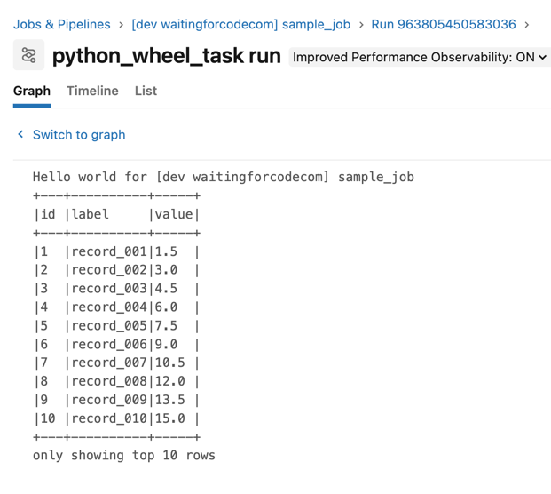

# Apache Spark on Databricks

1. Authenticate to your Databricks workspace, if you have not done so already:
```bash
databricks configure
```

2. To deploy a development copy of this project, type:
```bash
BROWSER="/Applications/Google Chrome.app/Contents/MacOS/Google Chrome" databricks auth login --profile personal_free_wfc 
databricks bundle deploy --target dev --profile personal_free_wfc
```

3. Replace the HOST in the [databricks.yml](databricks.yml) by your workspace URL.

# Try the demo
1. Deploy the job to your workspace:
```bash
databricks bundle deploy --target dev --profile personal_free_wfc
```

2. Go to your Databricks workspace and start the job. You should see some logs printed to the console:


3. Destroy the resources:
```bash 
databricks bundle destroy --target dev --profile personal_free_wfc
```
